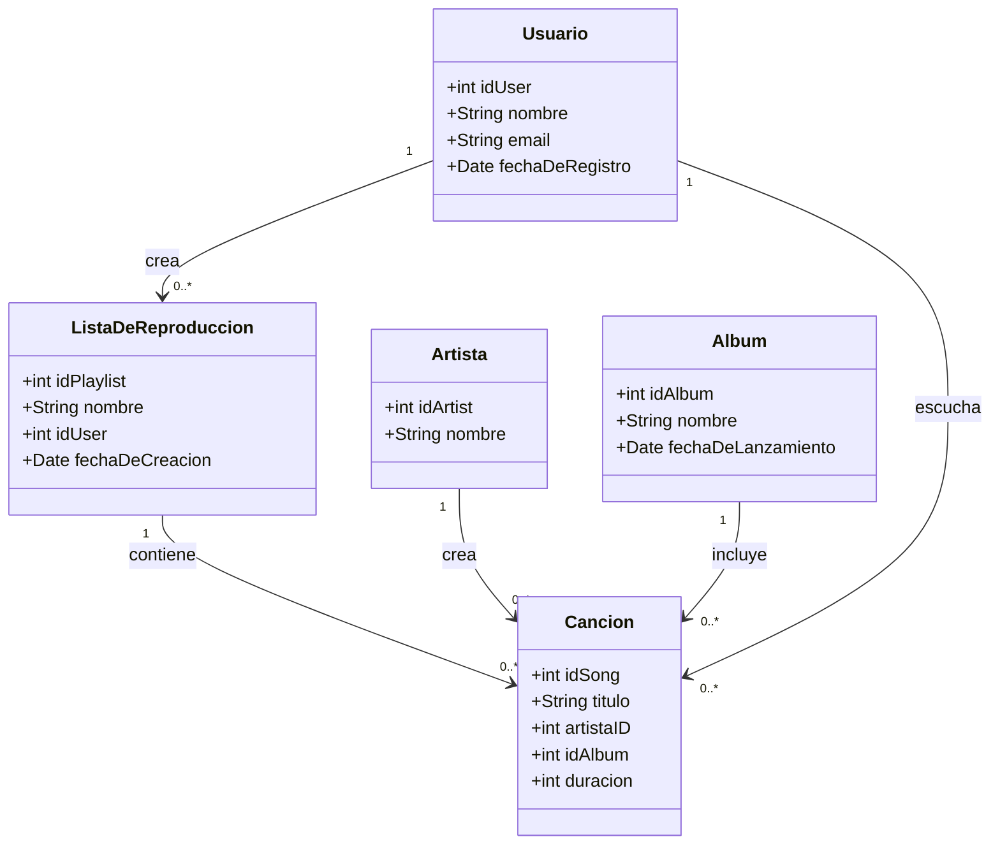

# Recuperación Hackaton 1 - CS2031 2024-1 🎧✨

## Calificación 

La evaluación se realizará mostrando el funcionamiento de los endpoints en vivo a uno de los miembros del jurado. Deberán crear sus endpoints en Postman para testear la funcionalidad. Solo si se demuestra la funcionalidad completa de todo el sistema se otorgará el puntaje completo.

## Descripción del Caso

Spotify es una plataforma líder en la transmisión de música digital, que permite a los usuarios acceder a una vasta biblioteca de canciones y artistas de todo el mundo. Para gestionar de manera eficiente su enorme cantidad de contenido y ofrecer una experiencia personalizada, Spotify utiliza un sofisticado sistema de bases de datos relacional. Este sistema abarca múltiples entidades clave y relaciones entre ellas para asegurar que los usuarios puedan descubrir, escuchar y organizar su música favorita de manera efectiva.

En este caso de estudio, analizamos cinco entidades principales del sistema de Spotify:

- *Usuario* 🧑‍💻
- *Canción* 🎵
- *Artista* 🎤
- *Álbum* 💿
- *Lista de Reproducción* 📃

La relación entre estas entidades se estructura de manera que refleja las complejas interacciones en la plataforma.

## Requisitos del Sistema

1. *Autenticación y Gestión de Usuarios:*
   - Registro de usuarios.
   - Inicio de sesión de usuarios.

2. *Gestión de Canciones:*
   - Información sobre las canciones disponibles.

3. *Gestión de Listas de Reproducción:*
   - Permitir a los usuarios crear, modificar y eliminar listas de reproducción.

4. *Relaciones Muchos a Muchos:*
   - Implementación de relaciones entre usuarios, canciones y listas de reproducción.

## Checkpoints 🛑

Habrá cuatro checkpoints definidos en base al progreso del proyecto:

1. **Checkpoint 1**: Implementación de todas las entidades.
2. **Checkpoint 2**: Desarrollo del sistema de autenticación.
3. **Checkpoint 3**: Implementación de los CRUDs para las entidades.
4. **Checkpoint 4**: Implementación de eventos y funcionalidades asíncronas.

## Diagrama de Clases con Mermaid 📚

## Funcionalidades 🌟

1. *Autenticación:*
   - *Registro*: Endpoint para que los usuarios se registren proporcionando nombre, correo electrónico y fecha de registro.
   - *Inicio de sesión*: Endpoint para que los usuarios se autentiquen utilizando su correo electrónico.

2. *Gestión de Canciones:*
   - *CRUD*: Endpoints para crear, leer, actualizar y eliminar información de las canciones.

3. *Gestión de Listas de Reproducción:*
   - *CRUD*: Endpoints para crear, leer, actualizar y eliminar listas de reproducción.

4. *Relaciones Muchos a Muchos:*
   - *Asociación de Canciones a Listas de Reproducción*: Endpoints para asociar canciones a las listas de reproducción y viceversa.

## Endpoints 🚀

- *Registro de Usuario:*
  - POST /usuarios/register
- *Inicio de Sesión:*
  - POST /usuarios/login
- *Gestión de Canciones:*
  - GET /canciones
  - POST /canciones
  - PUT /canciones/{id}
  - DELETE /canciones/{id}
- *Gestión de Listas de Reproducción:*
  - GET /users/{user_id}/playlists
  - GET /playlists/{playlist_id}
  - POST /users/{user_id}/playlists
  - PUT /playlists/{playlist_id}
  - DELETE /playlists/{playlist_id}
- *Gestión de Canciones en Listas de Reproducción:*
  - GET /playlists/{playlist_id}/songs
  - POST /playlists/{playlist_id}/songs
  - DELETE /playlists/{playlist_id}/songs/{song_id}

## Eventos y Asincronía 🎉

Cada vez que un usuario crea una lista de reproducción, se enviará una notificación por correo electrónico al usuario. Para ello, se implementará un servicio de envío de correos electrónicos que se ejecute de forma asíncrona. Este servicio se encargará de enviar la notificación de creación de la lista de reproducción al usuario.

Para lograr esto, se programará una tarea asíncrona que se ejecute en el momento de la creación de la lista de reproducción y realice el envío del correo electrónico.
